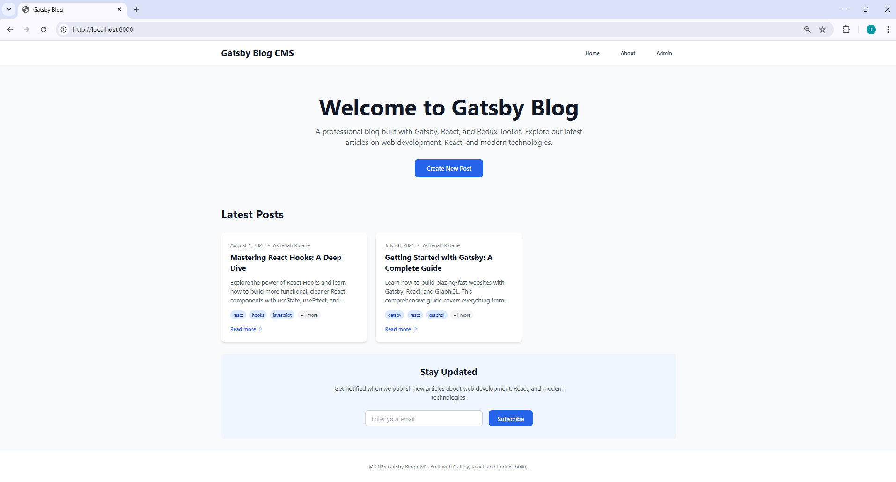
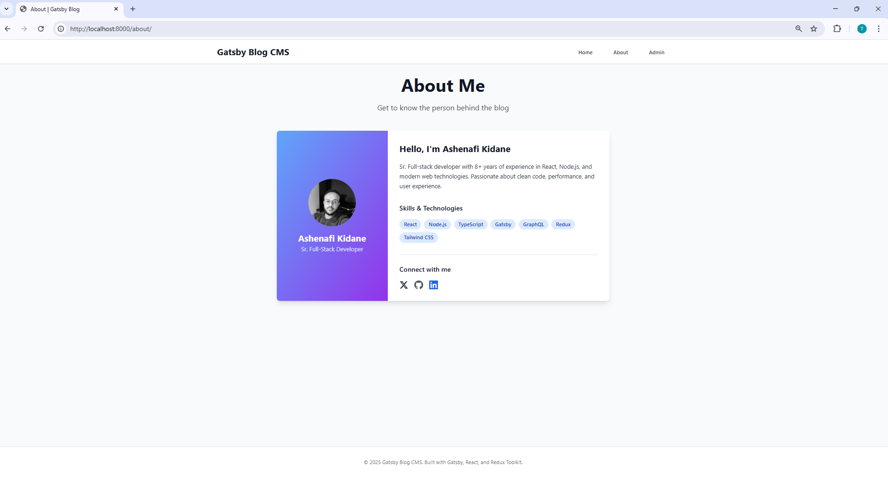
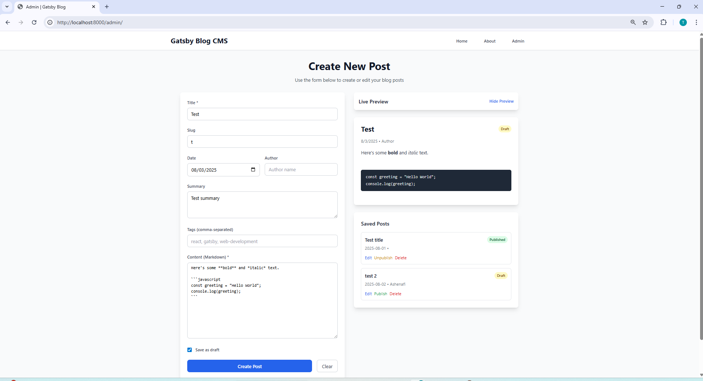

# Gatsby Blog

A professional, responsive blog CMS built with Gatsby, React, Redux Toolkit, and MDX. Features a beautiful UI with animations, admin interface for content management, and full SEO optimization.

## 🚀 Features

### Core Features

- **Homepage** - Display blog posts with responsive grid layout
- **Individual Post Pages** - Full MDX rendering with syntax highlighting
- **Admin Interface** - Create, edit, and manage blog posts with draft/publish functionality
- **About Page** - Author information with social links
- **SEO Optimization** - Meta tags, Open Graph, and canonical URLs

### Technical Features

- **Gatsby 5** - Latest version with GraphQL data layer
- **React 18** - Modern React with hooks
- **Redux Toolkit** - State management for admin interface
- **MDX** - Markdown with JSX support
- **TailwindCSS** - Utility-first CSS framework
- **Framer Motion** - Smooth animations and transitions
- **TypeScript** - Type safety throughout the application
- **Prism.js** - Syntax highlighting for code blocks (JavaScript, TypeScript, JSX, TSX, Bash, JSON, CSS, Markdown)
- **React Helmet** - Dynamic meta tag management

### UI/UX Features

- **Responsive Design** - Mobile-first approach
- **Dark/Light Theme Support** - Beautiful color schemes
- **Smooth Animations** - Page transitions and hover effects
- **Accessibility** - WCAG compliant components
- **Loading States** - User feedback during data fetching

## 📁 Project Structure

```
gatsby-blog-cms/
├── src/
│   ├── components/          # Reusable React components
│   │   ├── Layout.tsx      # Main layout wrapper
│   │   ├── PostCard.tsx    # Blog post preview card
│   │   ├── SEO.tsx         # SEO meta tag component
│   │   └── AdminForm.tsx   # Admin interface form
│   ├── data/               # Content files
│   │   ├── posts/          # MDX blog posts
│   │   └── authors/        # Author JSON files
│   ├── pages/              # Gatsby pages
│   │   ├── index.tsx       # Homepage
│   │   ├── about.tsx       # About page
│   │   └── admin.tsx       # Admin page
│   ├── templates/          # Page templates
│   │   └── post.tsx        # Individual post template
│   ├── state/              # Redux state management
│   │   ├── store.ts        # Redux store configuration
│   │   └── blogFormSlice.ts # Blog form state slice
│   ├── types/              # TypeScript type definitions
│   ├── utils/              # Utility functions (date formatting, slug generation, etc.)
│   └── styles/             # Global styles
├── gatsby-config.ts        # Gatsby configuration
├── gatsby-node.js          # Gatsby build APIs
├── gatsby-browser.js       # Browser APIs
└── package.json           # Dependencies and scripts
```

## 🎯 Important Implementation Decisions

### MDX vs JSON for Posts

- **Blog posts are loaded from .mdx files using Gatsby's GraphQL API**, which enables rich formatting, code blocks with syntax highlighting, and future extensibility with MDX components.
- **Benefits**: Rich content support, syntax highlighting, component integration, better developer experience
- **Alternative considered**: JSON files were evaluated but MDX provides better content authoring experience

### How Author Data is Used

- **The author data is rendered as static content at build time using a local JSON file**. This approach ensures fast page loads and aligns with Gatsby's static generation model, while keeping the site fully SEO-friendly and performant.
- **Benefits**: Fast loading, SEO optimization, consistent data structure, easy maintenance
- **Implementation**: Author data is imported directly from JSON files and used in components

### State Management Strategy

- **Redux Toolkit for admin interface only**: Used specifically for the admin form state and localStorage persistence, keeping the rest of the app simple with local state
- **Benefits**: Predictable state updates, dev tools, middleware support for persistence
- **Scope**: Limited to admin functionality to avoid over-engineering

### Content Organization

- **Data folder structure**: Content is organized in `src/data/` with separate folders for posts and authors
- **Separation of concerns**: Clear distinction between content (data) and presentation (components)
- **Scalability**: Easy to extend with additional content types

### SEO Implementation

- **React Helmet Async**: Chosen over react-helmet for better performance and SSR compatibility
- **Static generation**: All meta tags are generated at build time for optimal performance
- **Comprehensive coverage**: Open Graph, Twitter Cards, canonical URLs, and structured data

### Syntax Highlighting Implementation

- **Prism.js with gatsby-remark-prismjs**: Integrated for code block syntax highlighting
- **Multiple language support**: JavaScript, TypeScript, JSX, TSX, Bash, JSON, CSS, Markdown
- **Global availability**: Prism.js made available on window object for client-side highlighting

````

## 🛠 Installation & Setup

### Prerequisites
- Node.js 18+
- npm or yarn

### Quick Start

1. **Clone the repository**
   ```bash
   git clone <repository-url>
   cd gatsby-blog-cms
````

2. **Install dependencies**

   ```bash
   npm install
   ```

3. **Start development server**

   ```bash
   npm run develop
   ```

4. **Open your browser**
   Navigate to `http://localhost:8000`

### Available Scripts

- `npm run develop` - Start development server
- `npm run build` - Build for production
- `npm run serve` - Serve production build
- `npm run clean` - Clean Gatsby cache
- `npm run typecheck` - Run TypeScript type checking
- `npm test` - Run test suite
- `npm run test:watch` - Run tests in watch mode
- `npm run test:coverage` - Run tests with coverage report

## 📝 Content Management

### Creating Blog Posts

1. **Using the Admin Interface**

   - Navigate to `/admin`
   - Fill out the form with title, content, and metadata
     - Use the live preview to see your changes
   - Toggle between draft and published status
   - Save the post (stored in localStorage)

2. **Using MDX Files**

   - Create `.mdx` files in `src/data/posts/`
   - Add frontmatter with metadata:

   ```mdx
   ---
   title: "Your Post Title"
   slug: "your-post-slug"
   date: "2024-01-15"
   author: "John Doe"
   summary: "Brief description of your post"
   tags: ["react", "gatsby", "web-development"]
   ---

   # Your Post Content

   Write your content in Markdown...
   ```

### Managing Authors

Create JSON files in `src/data/authors/` with author information:

```json
{
  "name": "John Doe",
  "title": "Full-Stack Developer",
  "bio": "Full-stack developer with 8+ years of experience...",
  "image": "/images/john-doe.jpg",
  "skills": [
    "React",
    "Node.js",
    "TypeScript",
    "Gatsby",
    "GraphQL",
    "Redux",
    "Tailwind CSS"
  ],
  "social": {
    "twitter": "https://twitter.com/johndoe",
    "github": "https://github.com/johndoe",
    "linkedin": "https://linkedin.com/in/johndoe"
  }
}
```

## 🎨 Customization

### Styling

- **TailwindCSS** - Modify `tailwind.config.js` for theme customization
- **Global Styles** - Edit `src/styles/global.css` for custom CSS
- **Component Styles** - Use Tailwind classes in individual components

### Configuration

- **Site Metadata** - Update `gatsby-config.ts` for site information
- **SEO Settings** - Modify `src/components/SEO.tsx` for meta tag defaults
- **Redux State** - Extend `src/state/blogFormSlice.ts` for additional features

### Adding Features

- **New Pages** - Create files in `src/pages/`
- **New Components** - Add to `src/components/`
- **New Content Types** - Extend GraphQL queries and create templates

### Architecture Decisions

1. **Redux Toolkit** - Chosen for predictable state management and developer experience
2. **MDX** - Enables rich content with React components
3. **TailwindCSS** - Rapid UI development with consistent design system
4. **Framer Motion** - Smooth, performant animations
5. **TypeScript** - Type safety and better developer experience

### Key Components

- **Layout** - Consistent header, navigation, and footer across pages
- **PostCard** - Reusable component for displaying post previews
- **AdminForm** - Full-featured form with live preview and localStorage persistence
- **SEO** - Dynamic meta tag management for better discoverability

### State Management

The application uses Redux Toolkit for managing:

- Blog post form state
- Admin interface data
- localStorage persistence
- CRUD operations for posts

## 🧪 Testing

### Test Suite

The project includes a comprehensive test suite for the Redux state management layer:

- **Redux Slice Tests** - Tests for all blog form slice reducers and actions
- **State Management** - Tests for CRUD operations, form updates, and localStorage persistence
- **Edge Cases** - Tests for error handling and edge cases

### Running Tests

```bash
# Run all tests
npm test

# Run tests in watch mode (recommended for development)
npm run test:watch

# Run tests with coverage report
npm run test:coverage
```

### Test Coverage

The test suite covers:

- ✅ Initial state validation
- ✅ Field updates and form management
- ✅ Post creation and updates
- ✅ Post deletion and draft toggling
- ✅ localStorage persistence
- ✅ Error handling for edge cases

### Testing Best Practices

- **Jest** - JavaScript testing framework
- **React Testing Library** - For testing React components (when needed)
- **Redux Toolkit Testing** - Testing Redux slices with proper mocking
- **localStorage Mocking** - Proper mocking of browser APIs for testing

## 📊 Performance

- **Bundle Size**: Optimized with Gatsby's built-in optimizations
- **Image Optimization**: Automatic with gatsby-plugin-image
- **Code Splitting**: Automatic with Gatsby's routing

### 📸 Screenshots

#### 🏠 Home



#### 👤 About



#### 🛠️ Admin



## 🎥 Demo Video

Watch a short demo walkthrough on Loom: [Click here to watch](https://www.loom.com/share/021e689184dd4a33ada8afbcbd8b9992?sid=9b184399-0b25-44ba-8775-5e1ce3c5545f)

## 📄 License

This project is licensed under the MIT License.

---

✅ This project was built as part of a technical evaluation. If you have any questions, feel free to reach out!

Thanks for reviewing 🙏
